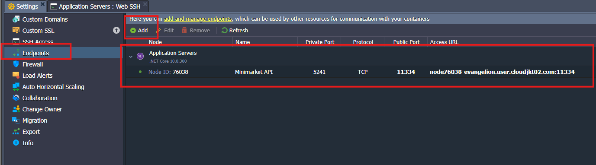

# Payment System Repository

## Dewacloud Deploy

Goal: Access API at: https://evangelion.user.cloudjkt02.com/api/...

Architecture:
Jelastic Proxy → .NET Server (port 5241)

### 1. Create Environment

Environment must include:

- .NET Server Node
- (Optional) MongoDB Node

### 2. Deploy .NET API

From Dewacloud:

- Open .NET node
- Deploy from GitHub (Auto deploy)
- Build the project

### 3. Configure Kestrel to Listen on All Interfaces

```csharp
builder.WebHost.ConfigureKestrel(o =>
{
    o.ListenAnyIP(5241);
});
```

This ensures the app is reachable internally.

### 4. Start the API

```bash
dotnet run --project Minimarket.API/Minimarket.API.csproj --environemt=Production
```

SSH into the .NET node:

```bash
curl http://localhost:5241/api/payment
```

If we get a response -> good.

### 5. Create a Public Endpoint for Port 5241

In Dewacloud dashboard:

Environment >> Settings >> Endpoints >> Add Endpoint

```bash
Internal Port: 5241
Protocol: HTTP
Public: Yes
```

Example:



This exposes API to the external Jelastic proxy.

### 6. Bind Domain to the .NET Node

Environment → Settings → Custom Domains

Bind: ```evangelion.user.cloudjkt02.com```

To:
.NET Server Node
Port 5241 (via endpoint above)

HTTPS is automatically handled by Dewacloud (Let’s Encrypt).

### 8. Test Public URL

Open: ```https://evangelion.user.cloudjkt02.com/api/payment```

If it works → deployment is correct.

Run On MongoDB:

To get local Hostname and Local IP<br>:
mongod@node76037-evangelion ```hostname -f```<br>
mongod@node76037-evangelion ```hostname -I```

Database__ConnectionString="mongodb://admin:<YOUR_PASSWORD>@<LOCAL_IP>:27017/Minimarket?authSource=admin" \
dotnet run --project Minimarket.API/Minimarket.API.csproj --environment=Production